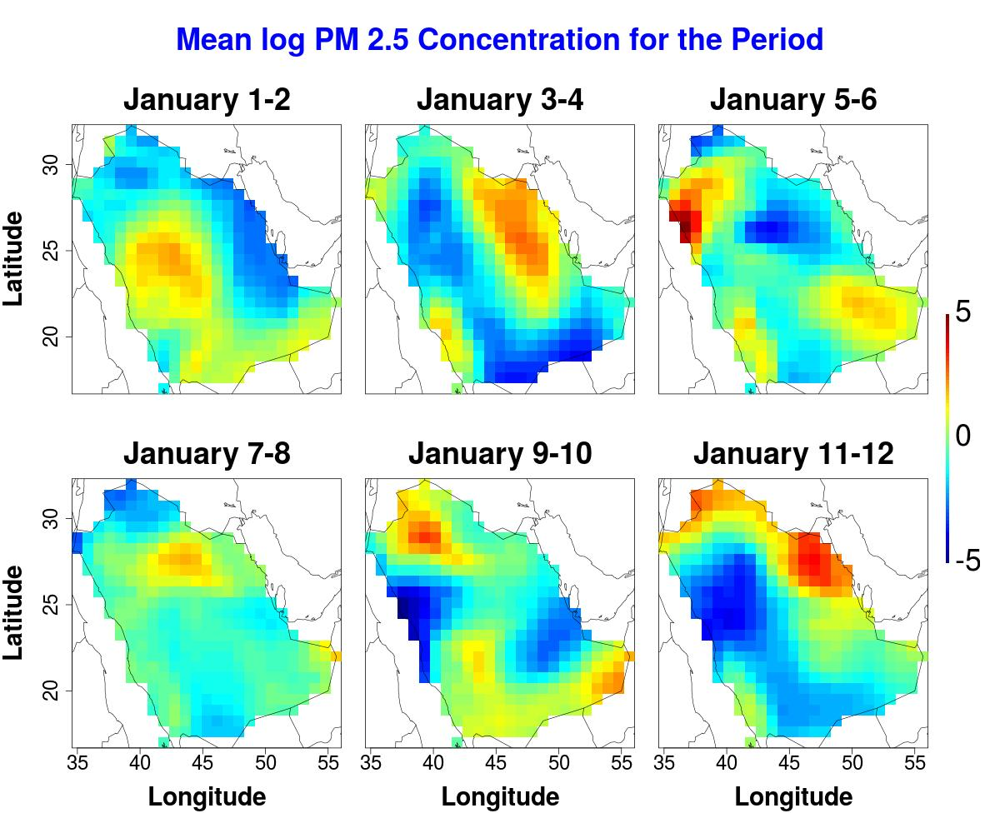
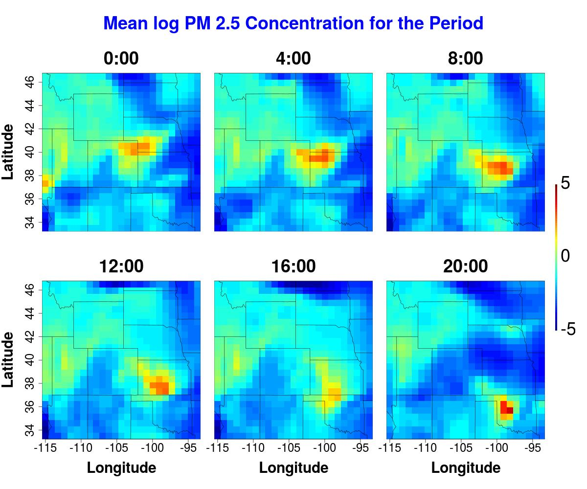

## SC21 Artifact Description / Article Evaluation for the paper entitled "Massively Parallel Likelihood Function Optimization to Accelerate Air Pollution Prediction on Large-Scale Systems"

### Reproducibility Steps
This repository includes steps and bash scripts to reproduce results and figures from the SC21 manuscript entitled "Massively Parallel Likelihood Function Optimization to Accelerate Air Pollution Prediction on Large-Scale Systems".

#### Notes:

* The two real PM2.5 datasets in the Middle-East and the US regions are in the "data" directory.
a. Visualization of the log PM2.5 dataset after space-time mean removing the size time points in 2016 over Saudi Arabia.

* Visualization of the log PM2.5 dataset after space-time mean removal at four-hour intervals on January 1, 2016, over the midwest US.

* Synthetic datasets are generated on the fly when assessing the proposed implementation's performance and accuracy.

* We intend to push the new code to the ExaGeoStat main directory (https://github.com/ecrc/exageostat) soon.

#### Reproduce performance and time-to-solution figures on a Cray XC40 system.

1- git clone https://github.com/SAbdulah/sc21_reproducibility_pswarm_mle

2- cd performance-reproducibility

3- Run install.sh   

(<em>To install all the dependencies of the proposed framework, i.e., NLopt, GSL, HWLOC, StarPU, Chamelon, and PPSwarm</em>)

4- source ./set_env.sh     

(<em>To set the required environment variables</em>)

5- sbatch job-st-tune_nb_17.sh   

(<em>Tuning tile size with 16 nodes (1 node for the PSwarm algorithm). Will use the best tile size for all the experiments</em>)

6- vim results.log    

(<em>The results summary is stored on results.log file where each row is structured as follows,</em>

	problem_size, number of nodes, nodes_per_mpi_sub_comm, estimated_model_params, tile_size, time_per_mle_iteration, total_flops_per_iteration, total_mle_time

<em>for best tile size performance (numbers at the second position from last). Tile size is at the 4th position from last</em>)

7- vim ./bash-performance-xcsystem.sh 

(<em>Update the tile size at the first line with the best from step 5</em>)

8- vim ./bash-time-to-solution-xcsystem.sh     

 (<em>Update the tile size at the first line with the best from step 5</em>)

9- ./bash-performance-xcsystem.sh               

(<em>Submit the performance jobs up to 1204 nodes</em>)

10- ./bash-time-to-solution-xcsystem.sh         

(<em>Submit the time-to-solution jobs up to 1024 nodes</em>)

#### Reproduce real datasets results in Table 1 on a Cray XC40 system.

1- sbatch script-1024-nodes-2-sub-comm-real-saudi-nonsep.sh

 (<em>Model the PM2.5 Saudi dataset using nonseperable space-time model</em>)

2- sbatch script-1024-nodes-2-sub-comm-real-saudi-sep.sh

 (<em>Model the PM2.5 Saudi dataset using seperable space-time model</em>)

3- sbatch script-1024-nodes-2-sub-comm-real-us-nonsep.sh

 (<em>Model the PM2.5 US dataset using nonseperable space-time model</em>)

4- sbatch script-1024-nodes-2-sub-comm-real-us-sep.sh

 (<em>Model the PM2.5 US dataset using seperable space-time model</em>)
